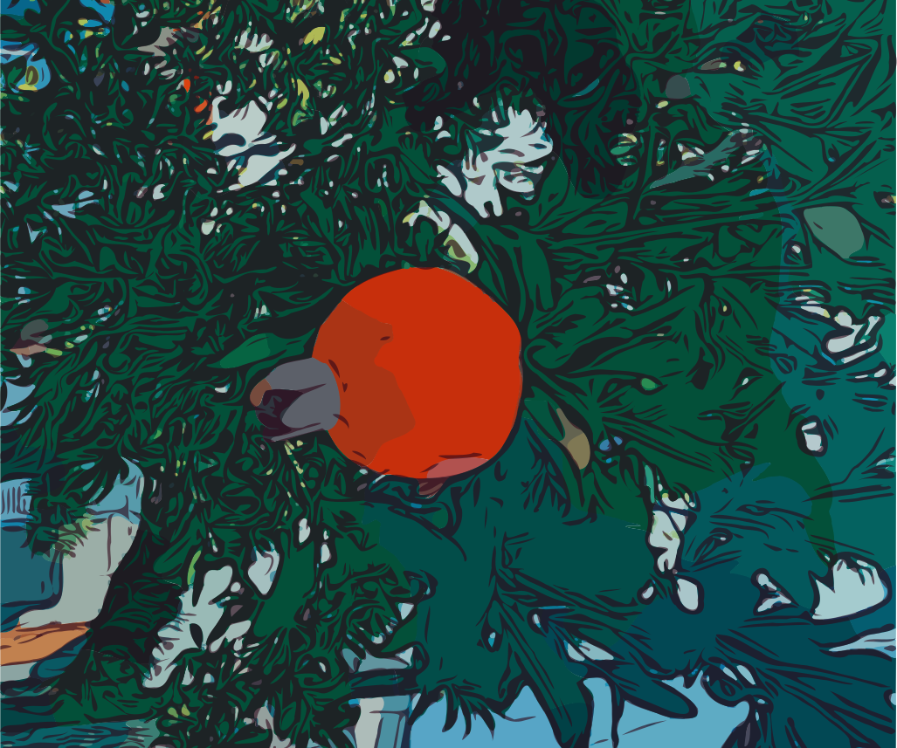

**riyan-ahmed/riyan-ahmed** is a ✨ _special_ ✨ repository because its `README.md` (this file) appears on your GitHub profile.

Here are some ideas to get you started:

- 🔭 I’m currently working on ...
- 🌱 I’m currently learning ...
- 👯 I’m looking to collaborate on ...
- 🤔 I’m looking for help with ...
- 💬 Ask me about ...
- 📫 How to reach me: ...
- 😄 Pronouns: ...
- ⚡ Fun fact: ...

<h4>

<a href="https://www.instagram.com/riyan.a/" target="blank">riyan.a</a> hello world 👋 

<a href="https://www.instagram.com/riyan.a/" target="blank">riyan.a</a> and my discord is <a href="https://discord.com/users/320781028165812236" target="blank">R.A#7406</a>

</h4> 

* * *

